# Star Tracker Report

**2026-02-14** | Total: **36239 stars** | Change: **+36223**

> Compared to snapshot from 2026-02-13

## 📈 Star Trend

### By Repository

![Top Repositories](https://quickchart.io/chart?w=800&h=400&c=%7B%22type%22%3A%22line%22%2C%22data%22%3A%7B%22labels%22%3A%5B%22Feb%2013%22%2C%22Feb%2013%22%2C%22Feb%2013%22%2C%22Feb%2013%22%2C%22Feb%2013%22%2C%22Feb%2013%22%2C%22Feb%2013%22%5D%2C%22datasets%22%3A%5B%7B%22label%22%3A%22EpicGames%2FUnrealEngine%22%2C%22data%22%3A%5B0%2C0%2C0%2C0%2C0%2C0%2C0%5D%2C%22borderColor%22%3A%22%23dfb317%22%2C%22backgroundColor%22%3A%22%23dfb31733%22%2C%22fill%22%3Afalse%2C%22tension%22%3A0.4%2C%22pointRadius%22%3A2%2C%22pointHoverRadius%22%3A5%7D%2C%7B%22label%22%3A%22EpicGames%2FUnrealTournament%22%2C%22data%22%3A%5B0%2C0%2C0%2C0%2C0%2C0%2C0%5D%2C%22borderColor%22%3A%22%2328a745%22%2C%22backgroundColor%22%3A%22%2328a74533%22%2C%22fill%22%3Afalse%2C%22tension%22%3A0.4%2C%22pointRadius%22%3A2%2C%22pointHoverRadius%22%3A5%7D%2C%7B%22label%22%3A%22EpicGames%2FUGCExample%22%2C%22data%22%3A%5B0%2C0%2C0%2C0%2C0%2C0%2C0%5D%2C%22borderColor%22%3A%22%23e74c3c%22%2C%22backgroundColor%22%3A%22%23e74c3c33%22%2C%22fill%22%3Afalse%2C%22tension%22%3A0.4%2C%22pointRadius%22%3A2%2C%22pointHoverRadius%22%3A5%7D%2C%7B%22label%22%3A%22EpicGames%2FARTv2%22%2C%22data%22%3A%5B0%2C0%2C0%2C0%2C0%2C0%2C0%5D%2C%22borderColor%22%3A%22%233498db%22%2C%22backgroundColor%22%3A%22%233498db33%22%2C%22fill%22%3Afalse%2C%22tension%22%3A0.4%2C%22pointRadius%22%3A2%2C%22pointHoverRadius%22%3A5%7D%2C%7B%22label%22%3A%22EpicGames%2Fzen%22%2C%22data%22%3A%5B0%2C0%2C0%2C0%2C0%2C0%2C0%5D%2C%22borderColor%22%3A%22%239b59b6%22%2C%22backgroundColor%22%3A%22%239b59b633%22%2C%22fill%22%3Afalse%2C%22tension%22%3A0.4%2C%22pointRadius%22%3A2%2C%22pointHoverRadius%22%3A5%7D%2C%7B%22label%22%3A%22EpicGames%2FShave-And-A-Haircut%22%2C%22data%22%3A%5B0%2C0%2C0%2C0%2C0%2C0%2C0%5D%2C%22borderColor%22%3A%22%23e67e22%22%2C%22backgroundColor%22%3A%22%23e67e2233%22%2C%22fill%22%3Afalse%2C%22tension%22%3A0.4%2C%22pointRadius%22%3A2%2C%22pointHoverRadius%22%3A5%7D%2C%7B%22label%22%3A%22fbuireu%2Fbiancafiore%22%2C%22data%22%3A%5B7%2C7%2C7%2C7%2C7%2C7%2C7%5D%2C%22borderColor%22%3A%22%231abc9c%22%2C%22backgroundColor%22%3A%22%231abc9c33%22%2C%22fill%22%3Afalse%2C%22tension%22%3A0.4%2C%22pointRadius%22%3A2%2C%22pointHoverRadius%22%3A5%7D%2C%7B%22label%22%3A%22fbuireu%2Ffbuireu%22%2C%22data%22%3A%5B5%2C5%2C5%2C5%2C5%2C5%2C5%5D%2C%22borderColor%22%3A%22%23e84393%22%2C%22backgroundColor%22%3A%22%23e8439333%22%2C%22fill%22%3Afalse%2C%22tension%22%3A0.4%2C%22pointRadius%22%3A2%2C%22pointHoverRadius%22%3A5%7D%2C%7B%22label%22%3A%22code-istvan%2Fbw%22%2C%22data%22%3A%5B1%2C1%2C1%2C1%2C1%2C1%2C1%5D%2C%22borderColor%22%3A%22%23795548%22%2C%22backgroundColor%22%3A%22%2379554833%22%2C%22fill%22%3Afalse%2C%22tension%22%3A0.4%2C%22pointRadius%22%3A2%2C%22pointHoverRadius%22%3A5%7D%2C%7B%22label%22%3A%22darioajmu%2Fohana_store%22%2C%22data%22%3A%5B0%2C0%2C0%2C0%2C0%2C0%2C0%5D%2C%22borderColor%22%3A%22%2300bcd4%22%2C%22backgroundColor%22%3A%22%2300bcd433%22%2C%22fill%22%3Afalse%2C%22tension%22%3A0.4%2C%22pointRadius%22%3A2%2C%22pointHoverRadius%22%3A5%7D%5D%7D%2C%22options%22%3A%7B%22responsive%22%3Atrue%2C%22maintainAspectRatio%22%3Afalse%2C%22plugins%22%3A%7B%22legend%22%3A%7B%22display%22%3Atrue%2C%22position%22%3A%22top%22%2C%22labels%22%3A%7B%22color%22%3A%22%2324292e%22%2C%22font%22%3A%7B%22size%22%3A11%7D%7D%7D%2C%22title%22%3A%7B%22display%22%3Atrue%2C%22text%22%3A%22Top%20Repositories%22%2C%22color%22%3A%22%2324292e%22%2C%22font%22%3A%7B%22size%22%3A16%2C%22weight%22%3A%22bold%22%7D%7D%7D%2C%22scales%22%3A%7B%22x%22%3A%7B%22grid%22%3A%7B%22color%22%3A%22%23eee%22%7D%2C%22ticks%22%3A%7B%22color%22%3A%22%236a737d%22%7D%7D%2C%22y%22%3A%7B%22grid%22%3A%7B%22color%22%3A%22%23eee%22%7D%2C%22ticks%22%3A%7B%22color%22%3A%22%236a737d%22%7D%2C%22beginAtZero%22%3Afalse%7D%7D%7D%7D)

Individual Repository Charts

#### EpicGames/UnrealEngine

![EpicGames/UnrealEngine](https://quickchart.io/chart?w=800&h=400&c=%7B%22type%22%3A%22line%22%2C%22data%22%3A%7B%22labels%22%3A%5B%22Feb%2013%22%2C%22Feb%2013%22%2C%22Feb%2013%22%2C%22Feb%2013%22%2C%22Feb%2013%22%2C%22Feb%2013%22%2C%22Feb%2013%22%5D%2C%22datasets%22%3A%5B%7B%22label%22%3A%22Stars%22%2C%22data%22%3A%5B0%2C0%2C0%2C0%2C0%2C0%2C0%5D%2C%22borderColor%22%3A%22%23dfb317%22%2C%22backgroundColor%22%3A%22%23dfb31733%22%2C%22fill%22%3Atrue%2C%22tension%22%3A0.4%2C%22pointRadius%22%3A3%2C%22pointHoverRadius%22%3A6%7D%5D%7D%2C%22options%22%3A%7B%22responsive%22%3Atrue%2C%22maintainAspectRatio%22%3Afalse%2C%22plugins%22%3A%7B%22legend%22%3A%7B%22display%22%3Afalse%2C%22position%22%3A%22top%22%2C%22labels%22%3A%7B%22color%22%3A%22%2324292e%22%2C%22font%22%3A%7B%22size%22%3A12%7D%7D%7D%2C%22title%22%3A%7B%22display%22%3Atrue%2C%22text%22%3A%22EpicGames%2FUnrealEngine%20Star%20History%22%2C%22color%22%3A%22%2324292e%22%2C%22font%22%3A%7B%22size%22%3A16%2C%22weight%22%3A%22bold%22%7D%7D%7D%2C%22scales%22%3A%7B%22x%22%3A%7B%22grid%22%3A%7B%22color%22%3A%22%23eee%22%7D%2C%22ticks%22%3A%7B%22color%22%3A%22%236a737d%22%7D%7D%2C%22y%22%3A%7B%22grid%22%3A%7B%22color%22%3A%22%23eee%22%7D%2C%22ticks%22%3A%7B%22color%22%3A%22%236a737d%22%7D%2C%22beginAtZero%22%3Afalse%7D%7D%7D%7D)

#### EpicGames/UnrealTournament

![EpicGames/UnrealTournament](https://quickchart.io/chart?w=800&h=400&c=%7B%22type%22%3A%22line%22%2C%22data%22%3A%7B%22labels%22%3A%5B%22Feb%2013%22%2C%22Feb%2013%22%2C%22Feb%2013%22%2C%22Feb%2013%22%2C%22Feb%2013%22%2C%22Feb%2013%22%2C%22Feb%2013%22%5D%2C%22datasets%22%3A%5B%7B%22label%22%3A%22Stars%22%2C%22data%22%3A%5B0%2C0%2C0%2C0%2C0%2C0%2C0%5D%2C%22borderColor%22%3A%22%23dfb317%22%2C%22backgroundColor%22%3A%22%23dfb31733%22%2C%22fill%22%3Atrue%2C%22tension%22%3A0.4%2C%22pointRadius%22%3A3%2C%22pointHoverRadius%22%3A6%7D%5D%7D%2C%22options%22%3A%7B%22responsive%22%3Atrue%2C%22maintainAspectRatio%22%3Afalse%2C%22plugins%22%3A%7B%22legend%22%3A%7B%22display%22%3Afalse%2C%22position%22%3A%22top%22%2C%22labels%22%3A%7B%22color%22%3A%22%2324292e%22%2C%22font%22%3A%7B%22size%22%3A12%7D%7D%7D%2C%22title%22%3A%7B%22display%22%3Atrue%2C%22text%22%3A%22EpicGames%2FUnrealTournament%20Star%20History%22%2C%22color%22%3A%22%2324292e%22%2C%22font%22%3A%7B%22size%22%3A16%2C%22weight%22%3A%22bold%22%7D%7D%7D%2C%22scales%22%3A%7B%22x%22%3A%7B%22grid%22%3A%7B%22color%22%3A%22%23eee%22%7D%2C%22ticks%22%3A%7B%22color%22%3A%22%236a737d%22%7D%7D%2C%22y%22%3A%7B%22grid%22%3A%7B%22color%22%3A%22%23eee%22%7D%2C%22ticks%22%3A%7B%22color%22%3A%22%236a737d%22%7D%2C%22beginAtZero%22%3Afalse%7D%7D%7D%7D)

#### EpicGames/UGCExample

![EpicGames/UGCExample](https://quickchart.io/chart?w=800&h=400&c=%7B%22type%22%3A%22line%22%2C%22data%22%3A%7B%22labels%22%3A%5B%22Feb%2013%22%2C%22Feb%2013%22%2C%22Feb%2013%22%2C%22Feb%2013%22%2C%22Feb%2013%22%2C%22Feb%2013%22%2C%22Feb%2013%22%5D%2C%22datasets%22%3A%5B%7B%22label%22%3A%22Stars%22%2C%22data%22%3A%5B0%2C0%2C0%2C0%2C0%2C0%2C0%5D%2C%22borderColor%22%3A%22%23dfb317%22%2C%22backgroundColor%22%3A%22%23dfb31733%22%2C%22fill%22%3Atrue%2C%22tension%22%3A0.4%2C%22pointRadius%22%3A3%2C%22pointHoverRadius%22%3A6%7D%5D%7D%2C%22options%22%3A%7B%22responsive%22%3Atrue%2C%22maintainAspectRatio%22%3Afalse%2C%22plugins%22%3A%7B%22legend%22%3A%7B%22display%22%3Afalse%2C%22position%22%3A%22top%22%2C%22labels%22%3A%7B%22color%22%3A%22%2324292e%22%2C%22font%22%3A%7B%22size%22%3A12%7D%7D%7D%2C%22title%22%3A%7B%22display%22%3Atrue%2C%22text%22%3A%22EpicGames%2FUGCExample%20Star%20History%22%2C%22color%22%3A%22%2324292e%22%2C%22font%22%3A%7B%22size%22%3A16%2C%22weight%22%3A%22bold%22%7D%7D%7D%2C%22scales%22%3A%7B%22x%22%3A%7B%22grid%22%3A%7B%22color%22%3A%22%23eee%22%7D%2C%22ticks%22%3A%7B%22color%22%3A%22%236a737d%22%7D%7D%2C%22y%22%3A%7B%22grid%22%3A%7B%22color%22%3A%22%23eee%22%7D%2C%22ticks%22%3A%7B%22color%22%3A%22%236a737d%22%7D%2C%22beginAtZero%22%3Afalse%7D%7D%7D%7D)

#### EpicGames/ARTv2

![EpicGames/ARTv2](https://quickchart.io/chart?w=800&h=400&c=%7B%22type%22%3A%22line%22%2C%22data%22%3A%7B%22labels%22%3A%5B%22Feb%2013%22%2C%22Feb%2013%22%2C%22Feb%2013%22%2C%22Feb%2013%22%2C%22Feb%2013%22%2C%22Feb%2013%22%2C%22Feb%2013%22%5D%2C%22datasets%22%3A%5B%7B%22label%22%3A%22Stars%22%2C%22data%22%3A%5B0%2C0%2C0%2C0%2C0%2C0%2C0%5D%2C%22borderColor%22%3A%22%23dfb317%22%2C%22backgroundColor%22%3A%22%23dfb31733%22%2C%22fill%22%3Atrue%2C%22tension%22%3A0.4%2C%22pointRadius%22%3A3%2C%22pointHoverRadius%22%3A6%7D%5D%7D%2C%22options%22%3A%7B%22responsive%22%3Atrue%2C%22maintainAspectRatio%22%3Afalse%2C%22plugins%22%3A%7B%22legend%22%3A%7B%22display%22%3Afalse%2C%22position%22%3A%22top%22%2C%22labels%22%3A%7B%22color%22%3A%22%2324292e%22%2C%22font%22%3A%7B%22size%22%3A12%7D%7D%7D%2C%22title%22%3A%7B%22display%22%3Atrue%2C%22text%22%3A%22EpicGames%2FARTv2%20Star%20History%22%2C%22color%22%3A%22%2324292e%22%2C%22font%22%3A%7B%22size%22%3A16%2C%22weight%22%3A%22bold%22%7D%7D%7D%2C%22scales%22%3A%7B%22x%22%3A%7B%22grid%22%3A%7B%22color%22%3A%22%23eee%22%7D%2C%22ticks%22%3A%7B%22color%22%3A%22%236a737d%22%7D%7D%2C%22y%22%3A%7B%22grid%22%3A%7B%22color%22%3A%22%23eee%22%7D%2C%22ticks%22%3A%7B%22color%22%3A%22%236a737d%22%7D%2C%22beginAtZero%22%3Afalse%7D%7D%7D%7D)

#### EpicGames/zen

![EpicGames/zen](https://quickchart.io/chart?w=800&h=400&c=%7B%22type%22%3A%22line%22%2C%22data%22%3A%7B%22labels%22%3A%5B%22Feb%2013%22%2C%22Feb%2013%22%2C%22Feb%2013%22%2C%22Feb%2013%22%2C%22Feb%2013%22%2C%22Feb%2013%22%2C%22Feb%2013%22%5D%2C%22datasets%22%3A%5B%7B%22label%22%3A%22Stars%22%2C%22data%22%3A%5B0%2C0%2C0%2C0%2C0%2C0%2C0%5D%2C%22borderColor%22%3A%22%23dfb317%22%2C%22backgroundColor%22%3A%22%23dfb31733%22%2C%22fill%22%3Atrue%2C%22tension%22%3A0.4%2C%22pointRadius%22%3A3%2C%22pointHoverRadius%22%3A6%7D%5D%7D%2C%22options%22%3A%7B%22responsive%22%3Atrue%2C%22maintainAspectRatio%22%3Afalse%2C%22plugins%22%3A%7B%22legend%22%3A%7B%22display%22%3Afalse%2C%22position%22%3A%22top%22%2C%22labels%22%3A%7B%22color%22%3A%22%2324292e%22%2C%22font%22%3A%7B%22size%22%3A12%7D%7D%7D%2C%22title%22%3A%7B%22display%22%3Atrue%2C%22text%22%3A%22EpicGames%2Fzen%20Star%20History%22%2C%22color%22%3A%22%2324292e%22%2C%22font%22%3A%7B%22size%22%3A16%2C%22weight%22%3A%22bold%22%7D%7D%7D%2C%22scales%22%3A%7B%22x%22%3A%7B%22grid%22%3A%7B%22color%22%3A%22%23eee%22%7D%2C%22ticks%22%3A%7B%22color%22%3A%22%236a737d%22%7D%7D%2C%22y%22%3A%7B%22grid%22%3A%7B%22color%22%3A%22%23eee%22%7D%2C%22ticks%22%3A%7B%22color%22%3A%22%236a737d%22%7D%2C%22beginAtZero%22%3Afalse%7D%7D%7D%7D)

#### EpicGames/Shave-And-A-Haircut

![EpicGames/Shave-And-A-Haircut](https://quickchart.io/chart?w=800&h=400&c=%7B%22type%22%3A%22line%22%2C%22data%22%3A%7B%22labels%22%3A%5B%22Feb%2013%22%2C%22Feb%2013%22%2C%22Feb%2013%22%2C%22Feb%2013%22%2C%22Feb%2013%22%2C%22Feb%2013%22%2C%22Feb%2013%22%5D%2C%22datasets%22%3A%5B%7B%22label%22%3A%22Stars%22%2C%22data%22%3A%5B0%2C0%2C0%2C0%2C0%2C0%2C0%5D%2C%22borderColor%22%3A%22%23dfb317%22%2C%22backgroundColor%22%3A%22%23dfb31733%22%2C%22fill%22%3Atrue%2C%22tension%22%3A0.4%2C%22pointRadius%22%3A3%2C%22pointHoverRadius%22%3A6%7D%5D%7D%2C%22options%22%3A%7B%22responsive%22%3Atrue%2C%22maintainAspectRatio%22%3Afalse%2C%22plugins%22%3A%7B%22legend%22%3A%7B%22display%22%3Afalse%2C%22position%22%3A%22top%22%2C%22labels%22%3A%7B%22color%22%3A%22%2324292e%22%2C%22font%22%3A%7B%22size%22%3A12%7D%7D%7D%2C%22title%22%3A%7B%22display%22%3Atrue%2C%22text%22%3A%22EpicGames%2FShave-And-A-Haircut%20Star%20History%22%2C%22color%22%3A%22%2324292e%22%2C%22font%22%3A%7B%22size%22%3A16%2C%22weight%22%3A%22bold%22%7D%7D%7D%2C%22scales%22%3A%7B%22x%22%3A%7B%22grid%22%3A%7B%22color%22%3A%22%23eee%22%7D%2C%22ticks%22%3A%7B%22color%22%3A%22%236a737d%22%7D%7D%2C%22y%22%3A%7B%22grid%22%3A%7B%22color%22%3A%22%23eee%22%7D%2C%22ticks%22%3A%7B%22color%22%3A%22%236a737d%22%7D%2C%22beginAtZero%22%3Afalse%7D%7D%7D%7D)

#### fbuireu/biancafiore

![fbuireu/biancafiore](https://quickchart.io/chart?w=800&h=400&c=%7B%22type%22%3A%22line%22%2C%22data%22%3A%7B%22labels%22%3A%5B%22Feb%2013%22%2C%22Feb%2013%22%2C%22Feb%2013%22%2C%22Feb%2013%22%2C%22Feb%2013%22%2C%22Feb%2013%22%2C%22Feb%2013%22%5D%2C%22datasets%22%3A%5B%7B%22label%22%3A%22Stars%22%2C%22data%22%3A%5B7%2C7%2C7%2C7%2C7%2C7%2C7%5D%2C%22borderColor%22%3A%22%23dfb317%22%2C%22backgroundColor%22%3A%22%23dfb31733%22%2C%22fill%22%3Atrue%2C%22tension%22%3A0.4%2C%22pointRadius%22%3A3%2C%22pointHoverRadius%22%3A6%7D%5D%7D%2C%22options%22%3A%7B%22responsive%22%3Atrue%2C%22maintainAspectRatio%22%3Afalse%2C%22plugins%22%3A%7B%22legend%22%3A%7B%22display%22%3Afalse%2C%22position%22%3A%22top%22%2C%22labels%22%3A%7B%22color%22%3A%22%2324292e%22%2C%22font%22%3A%7B%22size%22%3A12%7D%7D%7D%2C%22title%22%3A%7B%22display%22%3Atrue%2C%22text%22%3A%22fbuireu%2Fbiancafiore%20Star%20History%22%2C%22color%22%3A%22%2324292e%22%2C%22font%22%3A%7B%22size%22%3A16%2C%22weight%22%3A%22bold%22%7D%7D%7D%2C%22scales%22%3A%7B%22x%22%3A%7B%22grid%22%3A%7B%22color%22%3A%22%23eee%22%7D%2C%22ticks%22%3A%7B%22color%22%3A%22%236a737d%22%7D%7D%2C%22y%22%3A%7B%22grid%22%3A%7B%22color%22%3A%22%23eee%22%7D%2C%22ticks%22%3A%7B%22color%22%3A%22%236a737d%22%7D%2C%22beginAtZero%22%3Afalse%7D%7D%7D%7D)

#### fbuireu/fbuireu

![fbuireu/fbuireu](https://quickchart.io/chart?w=800&h=400&c=%7B%22type%22%3A%22line%22%2C%22data%22%3A%7B%22labels%22%3A%5B%22Feb%2013%22%2C%22Feb%2013%22%2C%22Feb%2013%22%2C%22Feb%2013%22%2C%22Feb%2013%22%2C%22Feb%2013%22%2C%22Feb%2013%22%5D%2C%22datasets%22%3A%5B%7B%22label%22%3A%22Stars%22%2C%22data%22%3A%5B5%2C5%2C5%2C5%2C5%2C5%2C5%5D%2C%22borderColor%22%3A%22%23dfb317%22%2C%22backgroundColor%22%3A%22%23dfb31733%22%2C%22fill%22%3Atrue%2C%22tension%22%3A0.4%2C%22pointRadius%22%3A3%2C%22pointHoverRadius%22%3A6%7D%5D%7D%2C%22options%22%3A%7B%22responsive%22%3Atrue%2C%22maintainAspectRatio%22%3Afalse%2C%22plugins%22%3A%7B%22legend%22%3A%7B%22display%22%3Afalse%2C%22position%22%3A%22top%22%2C%22labels%22%3A%7B%22color%22%3A%22%2324292e%22%2C%22font%22%3A%7B%22size%22%3A12%7D%7D%7D%2C%22title%22%3A%7B%22display%22%3Atrue%2C%22text%22%3A%22fbuireu%2Ffbuireu%20Star%20History%22%2C%22color%22%3A%22%2324292e%22%2C%22font%22%3A%7B%22size%22%3A16%2C%22weight%22%3A%22bold%22%7D%7D%7D%2C%22scales%22%3A%7B%22x%22%3A%7B%22grid%22%3A%7B%22color%22%3A%22%23eee%22%7D%2C%22ticks%22%3A%7B%22color%22%3A%22%236a737d%22%7D%7D%2C%22y%22%3A%7B%22grid%22%3A%7B%22color%22%3A%22%23eee%22%7D%2C%22ticks%22%3A%7B%22color%22%3A%22%236a737d%22%7D%2C%22beginAtZero%22%3Afalse%7D%7D%7D%7D)

#### code-istvan/bw

![code-istvan/bw](https://quickchart.io/chart?w=800&h=400&c=%7B%22type%22%3A%22line%22%2C%22data%22%3A%7B%22labels%22%3A%5B%22Feb%2013%22%2C%22Feb%2013%22%2C%22Feb%2013%22%2C%22Feb%2013%22%2C%22Feb%2013%22%2C%22Feb%2013%22%2C%22Feb%2013%22%5D%2C%22datasets%22%3A%5B%7B%22label%22%3A%22Stars%22%2C%22data%22%3A%5B1%2C1%2C1%2C1%2C1%2C1%2C1%5D%2C%22borderColor%22%3A%22%23dfb317%22%2C%22backgroundColor%22%3A%22%23dfb31733%22%2C%22fill%22%3Atrue%2C%22tension%22%3A0.4%2C%22pointRadius%22%3A3%2C%22pointHoverRadius%22%3A6%7D%5D%7D%2C%22options%22%3A%7B%22responsive%22%3Atrue%2C%22maintainAspectRatio%22%3Afalse%2C%22plugins%22%3A%7B%22legend%22%3A%7B%22display%22%3Afalse%2C%22position%22%3A%22top%22%2C%22labels%22%3A%7B%22color%22%3A%22%2324292e%22%2C%22font%22%3A%7B%22size%22%3A12%7D%7D%7D%2C%22title%22%3A%7B%22display%22%3Atrue%2C%22text%22%3A%22code-istvan%2Fbw%20Star%20History%22%2C%22color%22%3A%22%2324292e%22%2C%22font%22%3A%7B%22size%22%3A16%2C%22weight%22%3A%22bold%22%7D%7D%7D%2C%22scales%22%3A%7B%22x%22%3A%7B%22grid%22%3A%7B%22color%22%3A%22%23eee%22%7D%2C%22ticks%22%3A%7B%22color%22%3A%22%236a737d%22%7D%7D%2C%22y%22%3A%7B%22grid%22%3A%7B%22color%22%3A%22%23eee%22%7D%2C%22ticks%22%3A%7B%22color%22%3A%22%236a737d%22%7D%2C%22beginAtZero%22%3Afalse%7D%7D%7D%7D)

#### darioajmu/ohana_store

![darioajmu/ohana_store](https://quickchart.io/chart?w=800&h=400&c=%7B%22type%22%3A%22line%22%2C%22data%22%3A%7B%22labels%22%3A%5B%22Feb%2013%22%2C%22Feb%2013%22%2C%22Feb%2013%22%2C%22Feb%2013%22%2C%22Feb%2013%22%2C%22Feb%2013%22%2C%22Feb%2013%22%5D%2C%22datasets%22%3A%5B%7B%22label%22%3A%22Stars%22%2C%22data%22%3A%5B0%2C0%2C0%2C0%2C0%2C0%2C0%5D%2C%22borderColor%22%3A%22%23dfb317%22%2C%22backgroundColor%22%3A%22%23dfb31733%22%2C%22fill%22%3Atrue%2C%22tension%22%3A0.4%2C%22pointRadius%22%3A3%2C%22pointHoverRadius%22%3A6%7D%5D%7D%2C%22options%22%3A%7B%22responsive%22%3Atrue%2C%22maintainAspectRatio%22%3Afalse%2C%22plugins%22%3A%7B%22legend%22%3A%7B%22display%22%3Afalse%2C%22position%22%3A%22top%22%2C%22labels%22%3A%7B%22color%22%3A%22%2324292e%22%2C%22font%22%3A%7B%22size%22%3A12%7D%7D%7D%2C%22title%22%3A%7B%22display%22%3Atrue%2C%22text%22%3A%22darioajmu%2Fohana_store%20Star%20History%22%2C%22color%22%3A%22%2324292e%22%2C%22font%22%3A%7B%22size%22%3A16%2C%22weight%22%3A%22bold%22%7D%7D%7D%2C%22scales%22%3A%7B%22x%22%3A%7B%22grid%22%3A%7B%22color%22%3A%22%23eee%22%7D%2C%22ticks%22%3A%7B%22color%22%3A%22%236a737d%22%7D%7D%2C%22y%22%3A%7B%22grid%22%3A%7B%22color%22%3A%22%23eee%22%7D%2C%22ticks%22%3A%7B%22color%22%3A%22%236a737d%22%7D%2C%22beginAtZero%22%3Afalse%7D%7D%7D%7D)

## Repositories

| Repositories | Stars | Change | Trend |
|:-----------|------:|-------:|:-----:|
| [EpicGames/UnrealEngine](https://github.com/EpicGames/UnrealEngine) `NEW` | 32770 | 0 | ➖ |
| [EpicGames/UnrealTournament](https://github.com/EpicGames/UnrealTournament) `NEW` | 2429 | 0 | ➖ |
| [EpicGames/UGCExample](https://github.com/EpicGames/UGCExample) `NEW` | 409 | 0 | ➖ |
| [EpicGames/ARTv2](https://github.com/EpicGames/ARTv2) `NEW` | 242 | 0 | ➖ |
| [EpicGames/zen](https://github.com/EpicGames/zen) `NEW` | 193 | 0 | ➖ |
| [EpicGames/Shave-And-A-Haircut](https://github.com/EpicGames/Shave-And-A-Haircut) `NEW` | 179 | 0 | ➖ |
| [fbuireu/biancafiore](https://github.com/fbuireu/biancafiore) | 7 | 0 | ➖ |
| [fbuireu/fbuireu](https://github.com/fbuireu/fbuireu) | 5 | 0 | ➖ |
| [code-istvan/bw](https://github.com/code-istvan/bw) | 1 | 0 | ➖ |
| [darioajmu/ohana_store](https://github.com/darioajmu/ohana_store) `NEW` | 1 | 0 | ➖ |
| [fbuireu/curriculum-vitae](https://github.com/fbuireu/curriculum-vitae) | 1 | 0 | ➖ |
| [fbuireu/fbuireu-cli](https://github.com/fbuireu/fbuireu-cli) | 1 | 0 | ➖ |
| [fbuireu/github-star-tracker](https://github.com/fbuireu/github-star-tracker) | 1 | 0 | ➖ |
| [Almopt/copy-dash](https://github.com/Almopt/copy-dash) `NEW` | 0 | 0 | ➖ |
| [Almopt/copy-dashhh](https://github.com/Almopt/copy-dashhh) `NEW` | 0 | 0 | ➖ |
| [code-istvan/bw_astro_2024](https://github.com/code-istvan/bw_astro_2024) | 0 | 0 | ➖ |
| [commitvault/commit-vault-api](https://github.com/commitvault/commit-vault-api) `NEW` | 0 | 0 | ➖ |
| [commitvault/commit-vault-fe](https://github.com/commitvault/commit-vault-fe) `NEW` | 0 | 0 | ➖ |
| [commitvault/commitment-updater](https://github.com/commitvault/commitment-updater) `NEW` | 0 | 0 | ➖ |
| [devilylee/frontend](https://github.com/devilylee/frontend) `NEW` | 0 | 0 | ➖ |
| [fbuireu/email-signature](https://github.com/fbuireu/email-signature) | 0 | 0 | ➖ |
| [fbuireu/forever-pto](https://github.com/fbuireu/forever-pto) | 0 | 0 | ➖ |
| [fbuireu/hashnode-articles-backup](https://github.com/fbuireu/hashnode-articles-backup) | 0 | 0 | ➖ |
| [lilyhyojeonglee/code-review](https://github.com/lilyhyojeonglee/code-review) `NEW` | 0 | 0 | ➖ |
| [xing-e-recruiting-code-challenges/test_search-form-challenge_fbuireu_2022-05-13](https://github.com/xing-e-recruiting-code-challenges/test_search-form-challenge_fbuireu_2022-05-13) `NEW` | 0 | 0 | ➖ |

## New Repositories

- [Almopt/copy-dash](https://github.com/Almopt/copy-dash) — 0 stars
- [Almopt/copy-dashhh](https://github.com/Almopt/copy-dashhh) — 0 stars
- [commitvault/commit-vault-api](https://github.com/commitvault/commit-vault-api) — 0 stars
- [commitvault/commit-vault-fe](https://github.com/commitvault/commit-vault-fe) — 0 stars
- [commitvault/commitment-updater](https://github.com/commitvault/commitment-updater) — 0 stars
- [darioajmu/ohana_store](https://github.com/darioajmu/ohana_store) — 1 stars
- [devilylee/frontend](https://github.com/devilylee/frontend) — 0 stars
- [EpicGames/ARTv2](https://github.com/EpicGames/ARTv2) — 242 stars
- [EpicGames/Shave-And-A-Haircut](https://github.com/EpicGames/Shave-And-A-Haircut) — 179 stars
- [EpicGames/UGCExample](https://github.com/EpicGames/UGCExample) — 409 stars
- [EpicGames/UnrealEngine](https://github.com/EpicGames/UnrealEngine) — 32770 stars
- [EpicGames/UnrealTournament](https://github.com/EpicGames/UnrealTournament) — 2429 stars
- [EpicGames/zen](https://github.com/EpicGames/zen) — 193 stars
- [lilyhyojeonglee/code-review](https://github.com/lilyhyojeonglee/code-review) — 0 stars
- [xing-e-recruiting-code-challenges/test_search-form-challenge_fbuireu_2022-05-13](https://github.com/xing-e-recruiting-code-challenges/test_search-form-challenge_fbuireu_2022-05-13) — 0 stars

## Summary

- **Stars gained:** 0
- **Stars lost:** 0
- **Net change:** +36223

## 🔮 Growth Forecast

**Aggregate Forecast**

| Method | Week 1 | Week 2 | Week 3 | Week 4 |
|:---|---:|---:|---:|---:|
| Linear Regression | 16 | 16 | 16 | 16 |
| Weighted Moving Average | 16 | 16 | 16 | 16 |

![Growth Forecast](https://quickchart.io/chart?w=800&h=400&c=%7B%22type%22%3A%22line%22%2C%22data%22%3A%7B%22labels%22%3A%5B%22Feb%2013%22%2C%22Feb%2013%22%2C%22Feb%2013%22%2C%22Feb%2013%22%2C%22Feb%2013%22%2C%22Feb%2013%22%2C%22Feb%2013%22%2C%22Week%201%22%2C%22Week%202%22%2C%22Week%203%22%2C%22Week%204%22%5D%2C%22datasets%22%3A%5B%7B%22label%22%3A%22Star%20History%22%2C%22data%22%3A%5B16%2C16%2C16%2C16%2C16%2C16%2C16%2Cnull%2Cnull%2Cnull%2Cnull%5D%2C%22borderColor%22%3A%22%23dfb317%22%2C%22backgroundColor%22%3A%22%23dfb31733%22%2C%22fill%22%3Atrue%2C%22tension%22%3A0.4%2C%22pointRadius%22%3A3%2C%22pointHoverRadius%22%3A6%7D%2C%7B%22label%22%3A%22Linear%20Regression%22%2C%22data%22%3A%5Bnull%2Cnull%2Cnull%2Cnull%2Cnull%2Cnull%2C16%2C16%2C16%2C16%2C16%5D%2C%22borderColor%22%3A%22%2328a745%22%2C%22backgroundColor%22%3A%22transparent%22%2C%22fill%22%3Afalse%2C%22tension%22%3A0.4%2C%22pointRadius%22%3A2%2C%22pointHoverRadius%22%3A5%2C%22borderDash%22%3A%5B8%2C4%5D%7D%2C%7B%22label%22%3A%22Weighted%20Moving%20Average%22%2C%22data%22%3A%5Bnull%2Cnull%2Cnull%2Cnull%2Cnull%2Cnull%2C16%2C16%2C16%2C16%2C16%5D%2C%22borderColor%22%3A%22%23d73a49%22%2C%22backgroundColor%22%3A%22transparent%22%2C%22fill%22%3Afalse%2C%22tension%22%3A0.4%2C%22pointRadius%22%3A2%2C%22pointHoverRadius%22%3A5%2C%22borderDash%22%3A%5B4%2C4%5D%7D%5D%7D%2C%22options%22%3A%7B%22responsive%22%3Atrue%2C%22maintainAspectRatio%22%3Afalse%2C%22plugins%22%3A%7B%22legend%22%3A%7B%22display%22%3Atrue%2C%22position%22%3A%22top%22%2C%22labels%22%3A%7B%22color%22%3A%22%2324292e%22%2C%22font%22%3A%7B%22size%22%3A11%7D%7D%7D%2C%22title%22%3A%7B%22display%22%3Atrue%2C%22text%22%3A%22Growth%20Forecast%22%2C%22color%22%3A%22%2324292e%22%2C%22font%22%3A%7B%22size%22%3A16%2C%22weight%22%3A%22bold%22%7D%7D%7D%2C%22scales%22%3A%7B%22x%22%3A%7B%22grid%22%3A%7B%22color%22%3A%22%23eee%22%7D%2C%22ticks%22%3A%7B%22color%22%3A%22%236a737d%22%7D%7D%2C%22y%22%3A%7B%22grid%22%3A%7B%22color%22%3A%22%23eee%22%7D%2C%22ticks%22%3A%7B%22color%22%3A%22%236a737d%22%7D%2C%22beginAtZero%22%3Afalse%7D%7D%7D%7D)

### By Repository

EpicGames/UnrealEngine

**EpicGames/UnrealEngine**

| Method | Week 1 | Week 2 | Week 3 | Week 4 |
|:---|---:|---:|---:|---:|
| Linear Regression | 0 | 0 | 0 | 0 |
| Weighted Moving Average | 0 | 0 | 0 | 0 |

EpicGames/UnrealTournament

**EpicGames/UnrealTournament**

| Method | Week 1 | Week 2 | Week 3 | Week 4 |
|:---|---:|---:|---:|---:|
| Linear Regression | 0 | 0 | 0 | 0 |
| Weighted Moving Average | 0 | 0 | 0 | 0 |

EpicGames/UGCExample

**EpicGames/UGCExample**

| Method | Week 1 | Week 2 | Week 3 | Week 4 |
|:---|---:|---:|---:|---:|
| Linear Regression | 0 | 0 | 0 | 0 |
| Weighted Moving Average | 0 | 0 | 0 | 0 |

EpicGames/ARTv2

**EpicGames/ARTv2**

| Method | Week 1 | Week 2 | Week 3 | Week 4 |
|:---|---:|---:|---:|---:|
| Linear Regression | 0 | 0 | 0 | 0 |
| Weighted Moving Average | 0 | 0 | 0 | 0 |

EpicGames/zen

**EpicGames/zen**

| Method | Week 1 | Week 2 | Week 3 | Week 4 |
|:---|---:|---:|---:|---:|
| Linear Regression | 0 | 0 | 0 | 0 |
| Weighted Moving Average | 0 | 0 | 0 | 0 |

EpicGames/Shave-And-A-Haircut

**EpicGames/Shave-And-A-Haircut**

| Method | Week 1 | Week 2 | Week 3 | Week 4 |
|:---|---:|---:|---:|---:|
| Linear Regression | 0 | 0 | 0 | 0 |
| Weighted Moving Average | 0 | 0 | 0 | 0 |

fbuireu/biancafiore

**fbuireu/biancafiore**

| Method | Week 1 | Week 2 | Week 3 | Week 4 |
|:---|---:|---:|---:|---:|
| Linear Regression | 7 | 7 | 7 | 7 |
| Weighted Moving Average | 7 | 7 | 7 | 7 |

fbuireu/fbuireu

**fbuireu/fbuireu**

| Method | Week 1 | Week 2 | Week 3 | Week 4 |
|:---|---:|---:|---:|---:|
| Linear Regression | 5 | 5 | 5 | 5 |
| Weighted Moving Average | 5 | 5 | 5 | 5 |

code-istvan/bw

**code-istvan/bw**

| Method | Week 1 | Week 2 | Week 3 | Week 4 |
|:---|---:|---:|---:|---:|
| Linear Regression | 1 | 1 | 1 | 1 |
| Weighted Moving Average | 1 | 1 | 1 | 1 |

darioajmu/ohana_store

**darioajmu/ohana_store**

| Method | Week 1 | Week 2 | Week 3 | Week 4 |
|:---|---:|---:|---:|---:|
| Linear Regression | 0 | 0 | 0 | 0 |
| Weighted Moving Average | 0 | 0 | 0 | 0 |

---
*Generated by [GitHub Star Tracker](https://github.com/fbuireu/github-star-tracker) on 2026-02-14T21:04:46.797Z*
*Made with 🤘 by [Ferran Buireu](https://github.com/fbuireu)*