# Star Tracker Report

**2026-08-02** | Total: **24 stars** | Change: **+4**

> Compared to snapshot from 2026-07-26

## 📈 Star Trend

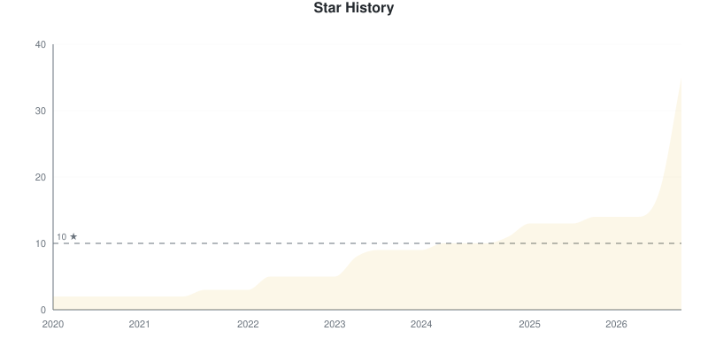

### By Repository

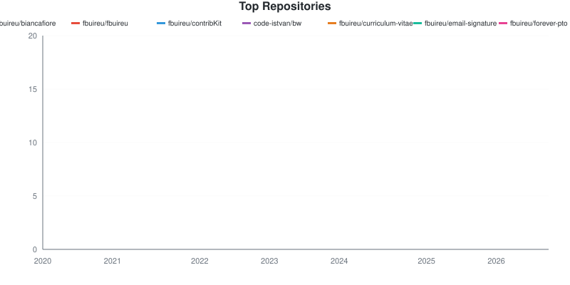

Individual Repository Charts

#### fbuireu/biancafiore

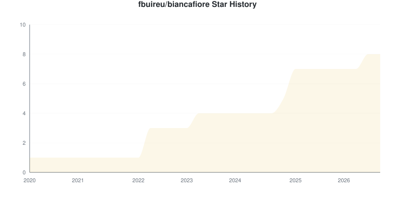

#### fbuireu/fbuireu

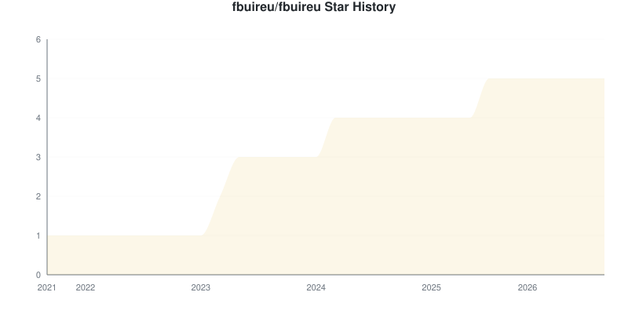

#### fbuireu/github-star-tracker

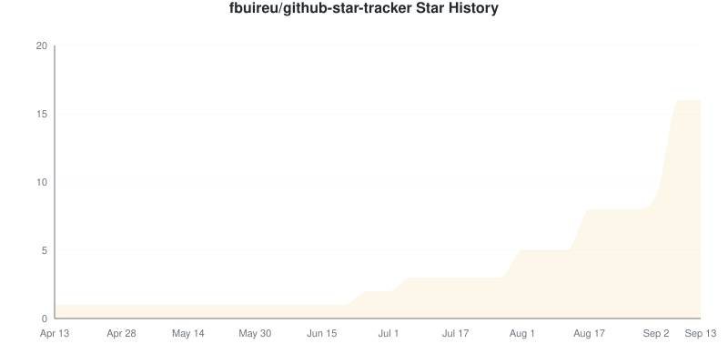

#### fbuireu/contribKit

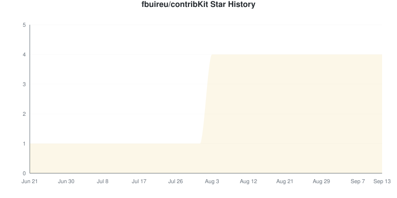

#### fbuireu/curriculum-vitae

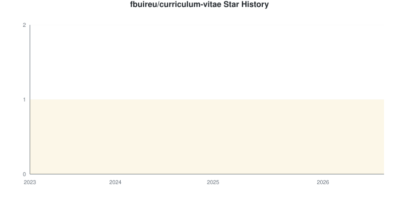

#### fbuireu/fbuireu-cli

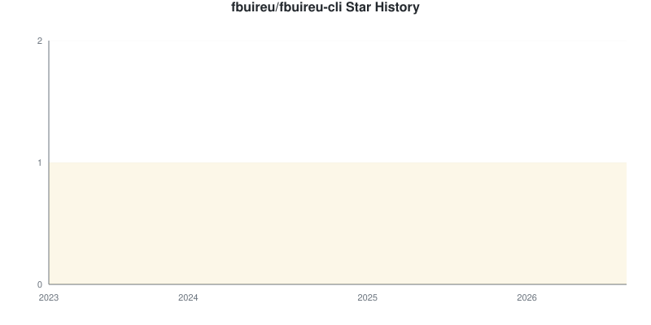

#### fbuireu/email-signature

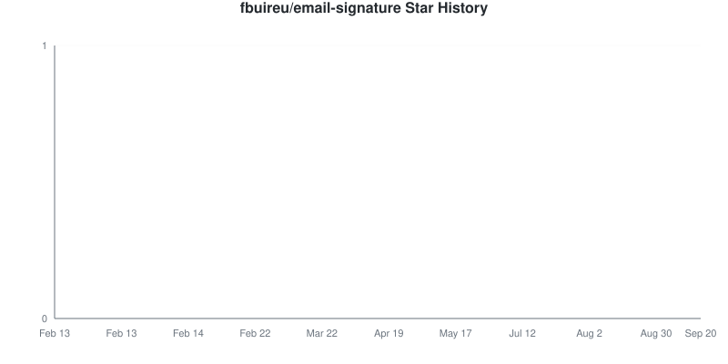

#### fbuireu/forever-pto

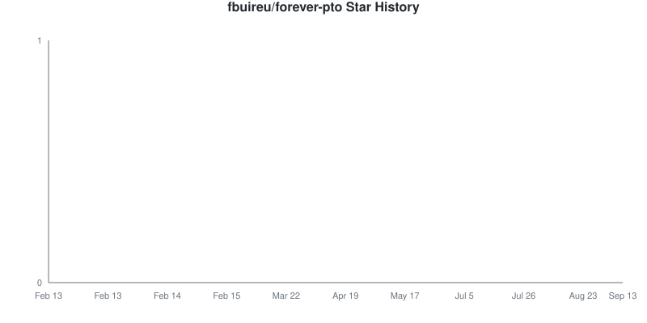

#### fbuireu/hashnode-articles-backup

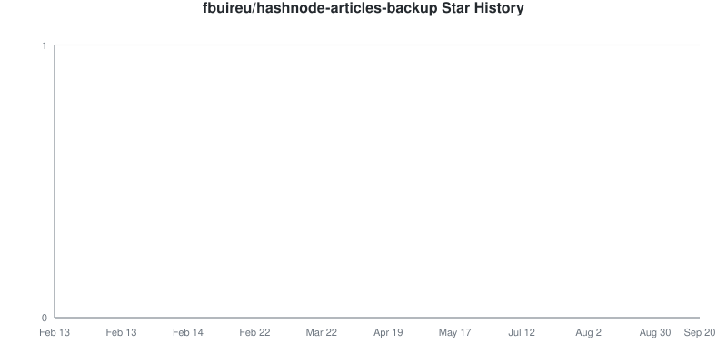

#### fbuireu/syncropharma

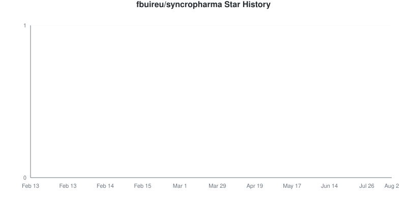

## Repositories

| Repositories | Stars | Change | Trend |
|:-----------|------:|-------:|:-----:|
| [fbuireu/biancafiore](https://github.com/fbuireu/biancafiore) | 8 | 0 | ➖ |
| [fbuireu/fbuireu](https://github.com/fbuireu/fbuireu) | 5 | 0 | ➖ |
| [fbuireu/github-star-tracker](https://github.com/fbuireu/github-star-tracker) | 5 | +1 | ⬆️ |
| [fbuireu/contribKit](https://github.com/fbuireu/contribKit) | 4 | +3 | ⬆️ |
| [fbuireu/curriculum-vitae](https://github.com/fbuireu/curriculum-vitae) | 1 | 0 | ➖ |
| [fbuireu/fbuireu-cli](https://github.com/fbuireu/fbuireu-cli) | 1 | 0 | ➖ |
| [fbuireu/email-signature](https://github.com/fbuireu/email-signature) | 0 | 0 | ➖ |
| [fbuireu/forever-pto](https://github.com/fbuireu/forever-pto) | 0 | 0 | ➖ |
| [fbuireu/hashnode-articles-backup](https://github.com/fbuireu/hashnode-articles-backup) | 0 | 0 | ➖ |
| [fbuireu/syncropharma](https://github.com/fbuireu/syncropharma) | 0 | 0 | ➖ |

## Summary

- **Stars gained:** 4
- **Stars lost:** 0
- **Net change:** +4

## 👤 New Stargazers

5 new stargazers since last run

fbuireu/contribKit (3 new)

-  [luciddream-tsin](https://github.com/luciddream-tsin): starred on 2026-08-01
-  [madhanio](https://github.com/madhanio): starred on 2026-08-01
-  [fazi-gondal](https://github.com/fazi-gondal): starred on 2026-08-01

fbuireu/github-star-tracker (2 new)

-  [isontheline](https://github.com/isontheline): starred on 2026-07-31
-  [elboletaire](https://github.com/elboletaire): starred on 2026-07-30

## 🔮 Growth Forecast

**Aggregate Forecast**

| Method | Week 1 | Week 2 | Week 3 | Week 4 |
|:---|---:|---:|---:|---:|
| Linear Regression | 24 | 24 | 24 | 24 |
| Weighted Moving Average | 24 | 24 | 24 | 24 |

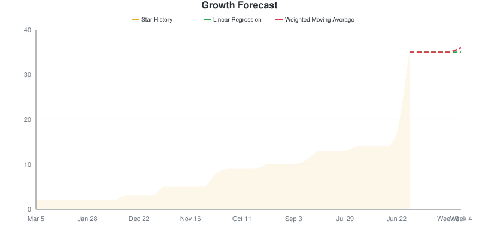

### By Repository

fbuireu/biancafiore

**fbuireu/biancafiore**

| Method | Week 1 | Week 2 | Week 3 | Week 4 |
|:---|---:|---:|---:|---:|
| Linear Regression | 8 | 8 | 8 | 8 |
| Weighted Moving Average | 8 | 8 | 8 | 8 |

fbuireu/fbuireu

**fbuireu/fbuireu**

| Method | Week 1 | Week 2 | Week 3 | Week 4 |
|:---|---:|---:|---:|---:|
| Linear Regression | 5 | 5 | 5 | 5 |
| Weighted Moving Average | 5 | 5 | 5 | 5 |

fbuireu/github-star-tracker

**fbuireu/github-star-tracker**

| Method | Week 1 | Week 2 | Week 3 | Week 4 |
|:---|---:|---:|---:|---:|
| Linear Regression | 5 | 5 | 5 | 5 |
| Weighted Moving Average | 5 | 5 | 5 | 5 |

fbuireu/contribKit

**fbuireu/contribKit**

| Method | Week 1 | Week 2 | Week 3 | Week 4 |
|:---|---:|---:|---:|---:|
| Linear Regression | 4 | 4 | 4 | 4 |
| Weighted Moving Average | 4 | 4 | 4 | 4 |

fbuireu/curriculum-vitae

**fbuireu/curriculum-vitae**

| Method | Week 1 | Week 2 | Week 3 | Week 4 |
|:---|---:|---:|---:|---:|
| Linear Regression | 1 | 1 | 1 | 1 |
| Weighted Moving Average | 1 | 1 | 1 | 1 |

fbuireu/fbuireu-cli

**fbuireu/fbuireu-cli**

| Method | Week 1 | Week 2 | Week 3 | Week 4 |
|:---|---:|---:|---:|---:|
| Linear Regression | 1 | 1 | 1 | 1 |
| Weighted Moving Average | 1 | 1 | 1 | 1 |

fbuireu/email-signature

**fbuireu/email-signature**

| Method | Week 1 | Week 2 | Week 3 | Week 4 |
|:---|---:|---:|---:|---:|
| Linear Regression | 0 | 0 | 0 | 0 |
| Weighted Moving Average | 0 | 0 | 0 | 0 |

fbuireu/forever-pto

**fbuireu/forever-pto**

| Method | Week 1 | Week 2 | Week 3 | Week 4 |
|:---|---:|---:|---:|---:|
| Linear Regression | 0 | 0 | 0 | 0 |
| Weighted Moving Average | 0 | 0 | 0 | 0 |

fbuireu/hashnode-articles-backup

**fbuireu/hashnode-articles-backup**

| Method | Week 1 | Week 2 | Week 3 | Week 4 |
|:---|---:|---:|---:|---:|
| Linear Regression | 0 | 0 | 0 | 0 |
| Weighted Moving Average | 0 | 0 | 0 | 0 |

fbuireu/syncropharma

**fbuireu/syncropharma**

| Method | Week 1 | Week 2 | Week 3 | Week 4 |
|:---|---:|---:|---:|---:|
| Linear Regression | 0 | 0 | 0 | 0 |
| Weighted Moving Average | 0 | 0 | 0 | 0 |

---
*Generated by [GitHub Star Tracker](https://github.com/fbuireu/github-star-tracker) on 2026-08-02T02:26:00.073Z*

*Made with 🤘 by [Ferran Buireu](https://github.com/fbuireu)*

