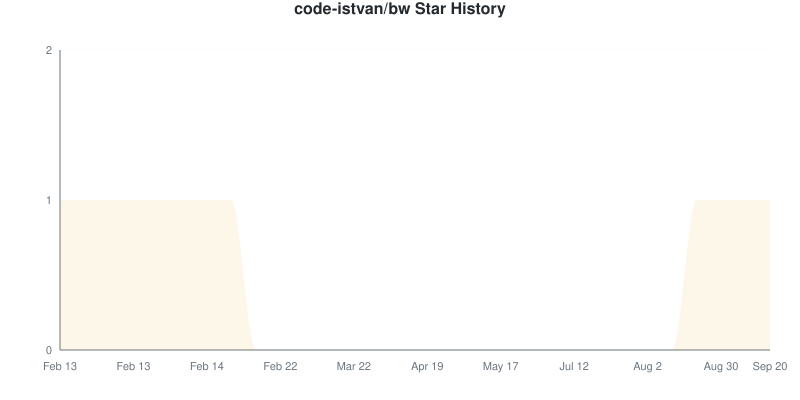
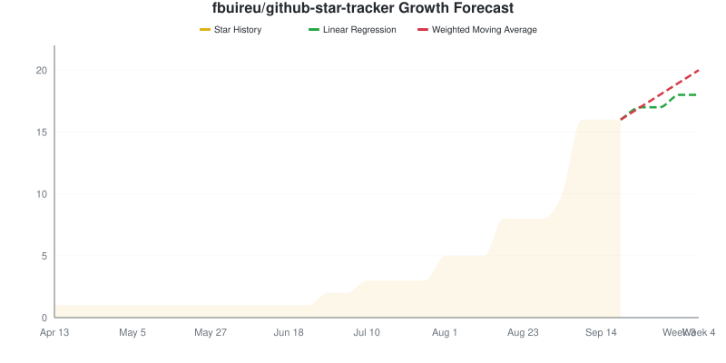
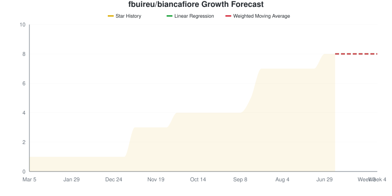
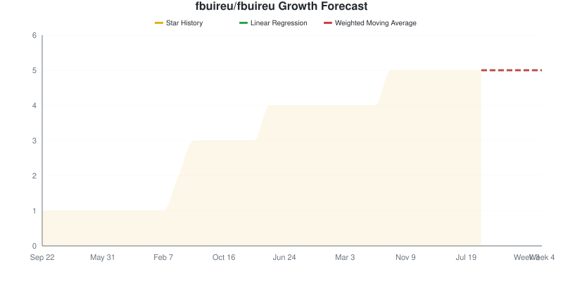
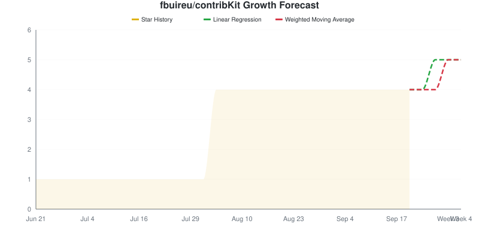
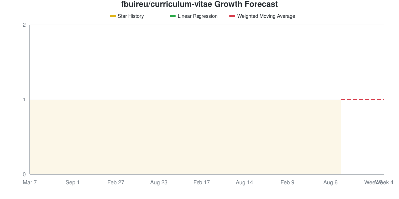

# Star Tracker Report

**2026-09-20** | Total: **35 stars** | Change: **0**

> Compared to snapshot from 2026-09-13

## 📈 Star Trend

### By Repository

Individual Repository Charts

#### fbuireu/github-star-tracker: 16 ★ (0)

#### fbuireu/biancafiore: 8 ★ (0)

#### fbuireu/fbuireu: 5 ★ (0)

#### fbuireu/contribKit: 4 ★ (0)

#### code-istvan/bw: 1 ★ (0)

#### fbuireu/curriculum-vitae: 1 ★ (0)

#### fbuireu/email-signature: 0 ★ (0)

#### fbuireu/forever-pto: 0 ★ (0)

#### fbuireu/hashnode-articles-backup: 0 ★ (0)

## Repositories

| Repositories | Stars | Change | Trend |
|:-----------|------:|-------:|:-----:|
| [fbuireu/github-star-tracker](https://github.com/fbuireu/github-star-tracker) | 16 | 0 | ➖ |
| [fbuireu/biancafiore](https://github.com/fbuireu/biancafiore) | 8 | 0 | ➖ |
| [fbuireu/fbuireu](https://github.com/fbuireu/fbuireu) | 5 | 0 | ➖ |
| [fbuireu/contribKit](https://github.com/fbuireu/contribKit) | 4 | 0 | ➖ |
| [code-istvan/bw](https://github.com/code-istvan/bw) | 1 | 0 | ➖ |
| [fbuireu/curriculum-vitae](https://github.com/fbuireu/curriculum-vitae) | 1 | 0 | ➖ |
| [fbuireu/email-signature](https://github.com/fbuireu/email-signature) | 0 | 0 | ➖ |
| [fbuireu/forever-pto](https://github.com/fbuireu/forever-pto) | 0 | 0 | ➖ |
| [fbuireu/hashnode-articles-backup](https://github.com/fbuireu/hashnode-articles-backup) | 0 | 0 | ➖ |

## 🔮 Growth Forecast

**Aggregate Forecast**

| Method | Week 1 | Week 2 | Week 3 | Week 4 |
|:---|---:|---:|---:|---:|
| Linear Regression | 35 | 35 | 35 | 35 |
| Weighted Moving Average | 35 | 35 | 35 | 36 |

### By Repository

fbuireu/github-star-tracker

**fbuireu/github-star-tracker**

| Method | Week 1 | Week 2 | Week 3 | Week 4 |
|:---|---:|---:|---:|---:|
| Linear Regression | 17 | 17 | 18 | 18 |
| Weighted Moving Average | 17 | 18 | 19 | 20 |

fbuireu/biancafiore

**fbuireu/biancafiore**

| Method | Week 1 | Week 2 | Week 3 | Week 4 |
|:---|---:|---:|---:|---:|
| Linear Regression | 8 | 8 | 8 | 8 |
| Weighted Moving Average | 8 | 8 | 8 | 8 |

fbuireu/fbuireu

**fbuireu/fbuireu**

| Method | Week 1 | Week 2 | Week 3 | Week 4 |
|:---|---:|---:|---:|---:|
| Linear Regression | 5 | 5 | 5 | 5 |
| Weighted Moving Average | 5 | 5 | 5 | 5 |

fbuireu/contribKit

**fbuireu/contribKit**

| Method | Week 1 | Week 2 | Week 3 | Week 4 |
|:---|---:|---:|---:|---:|
| Linear Regression | 4 | 5 | 5 | 5 |
| Weighted Moving Average | 4 | 4 | 5 | 5 |

code-istvan/bw

**code-istvan/bw**

| Method | Week 1 | Week 2 | Week 3 | Week 4 |
|:---|---:|---:|---:|---:|
| Linear Regression | 1 | 1 | 1 | 1 |
| Weighted Moving Average | 1 | 1 | 1 | 1 |

fbuireu/curriculum-vitae

**fbuireu/curriculum-vitae**

| Method | Week 1 | Week 2 | Week 3 | Week 4 |
|:---|---:|---:|---:|---:|
| Linear Regression | 1 | 1 | 1 | 1 |
| Weighted Moving Average | 1 | 1 | 1 | 1 |

fbuireu/email-signature

**fbuireu/email-signature**

| Method | Week 1 | Week 2 | Week 3 | Week 4 |
|:---|---:|---:|---:|---:|
| Linear Regression | 0 | 0 | 0 | 0 |
| Weighted Moving Average | 0 | 0 | 0 | 0 |

fbuireu/forever-pto

**fbuireu/forever-pto**

| Method | Week 1 | Week 2 | Week 3 | Week 4 |
|:---|---:|---:|---:|---:|
| Linear Regression | 0 | 0 | 0 | 0 |
| Weighted Moving Average | 0 | 0 | 0 | 0 |

fbuireu/hashnode-articles-backup

**fbuireu/hashnode-articles-backup**

| Method | Week 1 | Week 2 | Week 3 | Week 4 |
|:---|---:|---:|---:|---:|
| Linear Regression | 0 | 0 | 0 | 0 |
| Weighted Moving Average | 0 | 0 | 0 | 0 |

---
*Generated by [GitHub Star Tracker](https://github.com/fbuireu/github-star-tracker) on 2026-09-20T03:11:34.409Z*

*Made with 🤘 by [Ferran Buireu](https://github.com/fbuireu)*

