# Star Tracker Report

**2026-10-25** | Total: **35 stars** | Change: **0**

> Compared to snapshot from 2026-10-18

## 📈 Star Trend

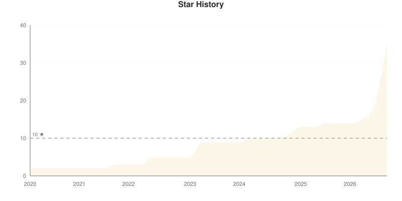

### By Repository

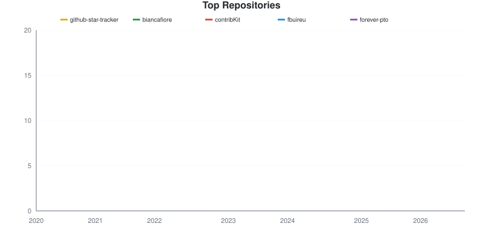

Individual Repository Charts

#### fbuireu/github-star-tracker: 17 ★ (+1)

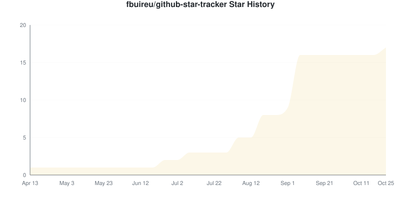

#### fbuireu/biancafiore: 8 ★ (0)

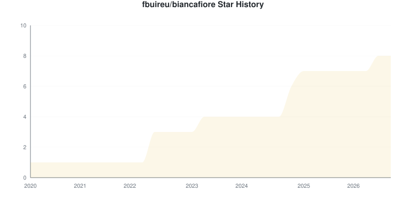

#### fbuireu/contribKit: 5 ★ (+1)

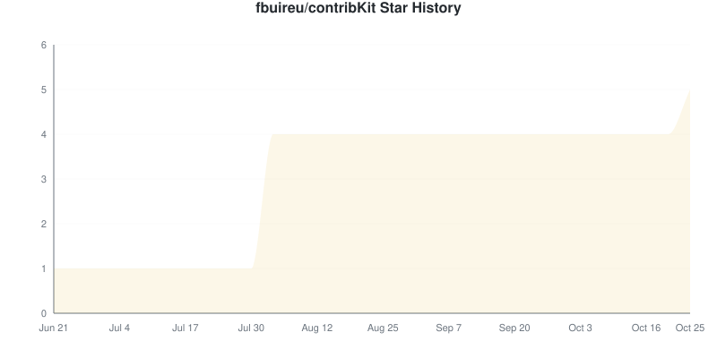

#### fbuireu/fbuireu: 5 ★ (0)

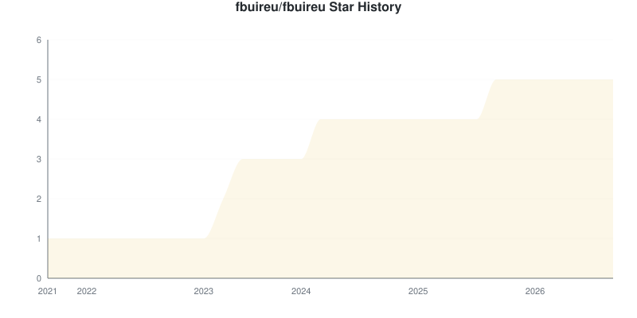

#### fbuireu/forever-pto: 0 ★ (0)

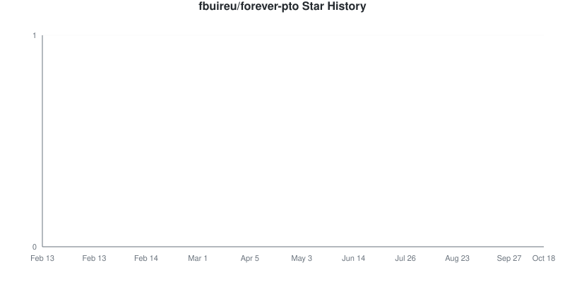

## Repositories

| Repositories | Stars | Change | Trend |
|:-----------|------:|-------:|:-----:|
| [fbuireu/github-star-tracker](https://github.com/fbuireu/github-star-tracker) | 17 | +1 | ⬆️ |
| [fbuireu/biancafiore](https://github.com/fbuireu/biancafiore) | 8 | 0 | ➖ |
| [fbuireu/contribKit](https://github.com/fbuireu/contribKit) | 5 | +1 | ⬆️ |
| [fbuireu/fbuireu](https://github.com/fbuireu/fbuireu) | 5 | 0 | ➖ |
| [fbuireu/forever-pto](https://github.com/fbuireu/forever-pto) | 0 | 0 | ➖ |

## Removed Repositories

code-istvan/bw: was 1 stars
fbuireu/curriculum-vitae: was 1 stars
fbuireu/email-signature: was 0 stars
fbuireu/hashnode-articles-backup: was 0 stars

## Summary

- **Stars gained:** 2
- **Stars lost:** 2
- **Net change:** 0

## 🔮 Growth Forecast

**Aggregate Forecast**

| Method | Week 1 | Week 2 | Week 3 | Week 4 |
|:---|---:|---:|---:|---:|
| Linear Regression | 35 | 35 | 35 | 35 |
| Weighted Moving Average | 35 | 35 | 35 | 36 |

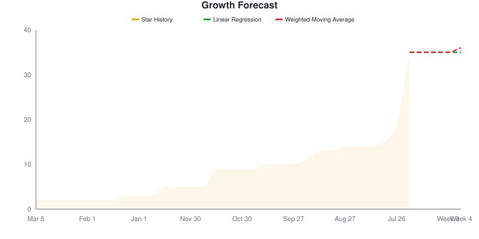

### By Repository

fbuireu/github-star-tracker

**fbuireu/github-star-tracker**

| Method | Week 1 | Week 2 | Week 3 | Week 4 |
|:---|---:|---:|---:|---:|
| Linear Regression | 18 | 18 | 19 | 20 |
| Weighted Moving Average | 18 | 19 | 19 | 20 |

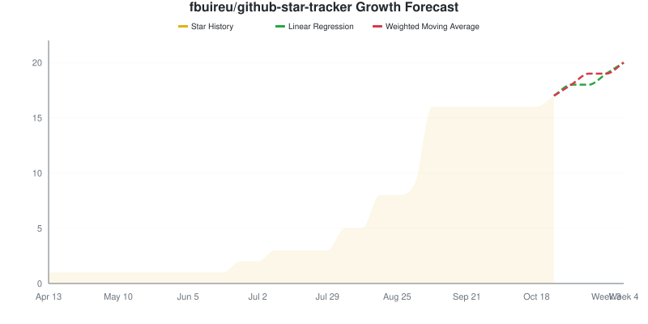

fbuireu/biancafiore

**fbuireu/biancafiore**

| Method | Week 1 | Week 2 | Week 3 | Week 4 |
|:---|---:|---:|---:|---:|
| Linear Regression | 8 | 8 | 8 | 8 |
| Weighted Moving Average | 8 | 8 | 8 | 8 |

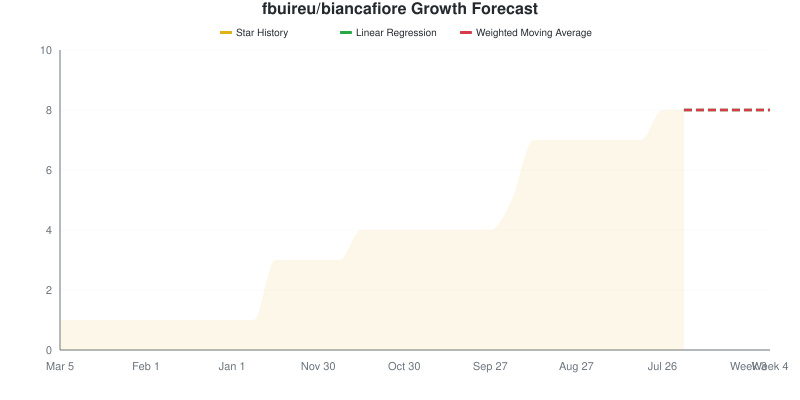

fbuireu/contribKit

**fbuireu/contribKit**

| Method | Week 1 | Week 2 | Week 3 | Week 4 |
|:---|---:|---:|---:|---:|
| Linear Regression | 5 | 5 | 6 | 6 |
| Weighted Moving Average | 5 | 5 | 6 | 6 |

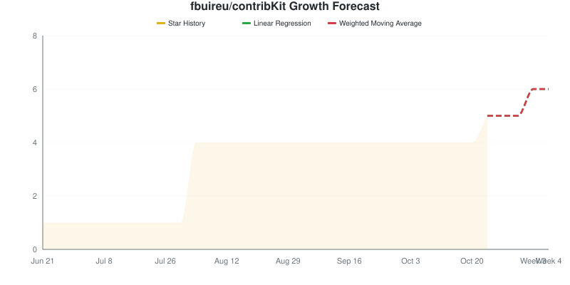

fbuireu/fbuireu

**fbuireu/fbuireu**

| Method | Week 1 | Week 2 | Week 3 | Week 4 |
|:---|---:|---:|---:|---:|
| Linear Regression | 5 | 5 | 5 | 5 |
| Weighted Moving Average | 5 | 5 | 5 | 5 |

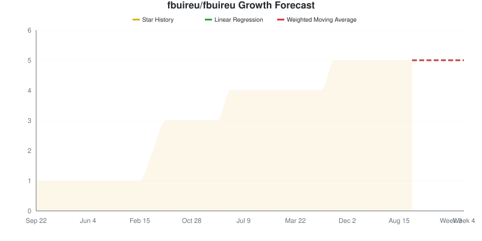

fbuireu/forever-pto

**fbuireu/forever-pto**

| Method | Week 1 | Week 2 | Week 3 | Week 4 |
|:---|---:|---:|---:|---:|
| Linear Regression | 0 | 0 | 0 | 0 |
| Weighted Moving Average | 0 | 0 | 0 | 0 |

---
*Generated by [GitHub Star Tracker](https://github.com/fbuireu/github-star-tracker) on 2026-10-25T03:01:19.978Z*

*Made with 🤘 by [Ferran Buireu](https://github.com/fbuireu)*

